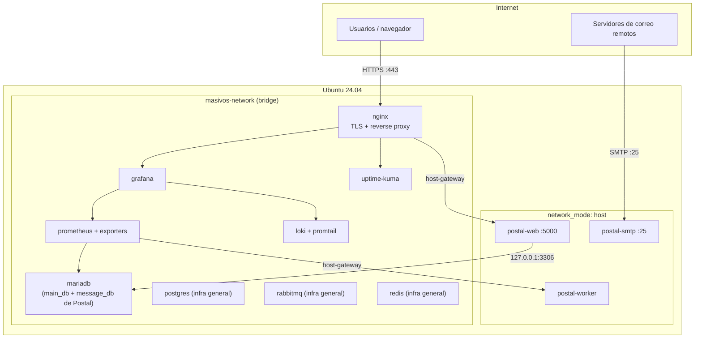

# masivos-infra

Infraestructura reproducible para **Masivos.app** — una plataforma de envío/recepción de correo masivo basada en [Postal](https://github.com/postalserver/postal), desplegable desde cero sobre Ubuntu 24.04 con Docker Compose. Todo versionado, idempotente y sin configuración manual fuera de los secretos (`.env`).

```bash
sudo ./bootstrap/install.sh --environment prod
sudo ./security/hardening.sh --environment prod
sudo ./scripts/deploy.sh --environment prod
```

## Tabla de contenidos

- [Arquitectura](#arquitectura)
- [Stack](#stack)
- [Estructura del repositorio](#estructura-del-repositorio)
- [Requisitos](#requisitos)
- [Despliegue desde cero](#despliegue-desde-cero)
- [Operación](#operación)
- [Entornos](#entornos)
- [Seguridad](#seguridad)
- [DNS](#dns)
- [Decisiones de arquitectura no obvias](#decisiones-de-arquitectura-no-obvias)
- [Documentación](#documentación)

## Arquitectura

Un **servidor por entorno** (`dev`, `test`, `prod`) — no un multi-tenant en la misma máquina. La mayoría de los servicios corren en una red Docker aislada (`masivos-network`) sin puertos publicados al host; Postal es la excepción deliberada (ver más abajo).



Diagrama completo, tabla de puertos y justificación de cada excepción de red: **[`docs/architecture.md`](docs/architecture.md)**.

## Stack

| Categoría | Tecnología |
|---|---|
| Sistema base | Ubuntu 24.04, Docker Engine (repo oficial) |
| Correo | [Postal](https://github.com/postalserver/postal) v3 |
| Base de datos de Postal | MariaDB 11 |
| Infraestructura general (no consumida por Postal) | PostgreSQL 16, Redis 7, RabbitMQ 3 |
| Borde / TLS | Nginx, Let's Encrypt (`certbot-dns-cloudflare`, DNS-01) |
| Observabilidad | Prometheus + exporters, Grafana, Loki + Promtail |
| Disponibilidad | Uptime Kuma |
| Seguridad | UFW, Fail2Ban, SSH hardening, sysctl hardening |
| CI/CD | GitHub Actions (lint automático, despliegue manual) |

> **Nota importante:** el stack original contemplaba PostgreSQL/Redis/RabbitMQ como backend de Postal. Al verificar contra la documentación oficial de Postal (no asumido) se confirmó que **Postal v3 requiere MariaDB exclusivamente** y no usa RabbitMQ ni Redis. Esos tres servicios se conservan como infraestructura genérica reutilizable, no como dependencias de Postal. Detalle completo: [`services/mariadb/README.md`](services/mariadb/README.md).

## Estructura del repositorio

```
masivos-infra/
├── bootstrap/          # Provisión base de Ubuntu 24.04 (paquetes, timezone, hostname, usuarios)
├── security/            # Hardening: SSH, UFW, Fail2Ban, sysctl, logrotate
├── docker/              # Docker Engine, daemon.json, red, volúmenes, compose principal
├── environments/        # Variables por entorno (dev/test/prod) — plantillas .env.example
├── services/            # Un directorio por servicio, cada uno independiente y autocontenido
│   ├── mariadb/          # Base de datos real de Postal
│   ├── postal/           # SMTP + Web + Worker (network_mode: host)
│   ├── nginx/             # Reverse proxy TLS + emisión de certificados
│   ├── prometheus/        # Métricas + exporters
│   ├── grafana/           # Dashboards
│   ├── loki/               # Logs agregados
│   ├── uptime-kuma/        # Monitoreo de disponibilidad externo
│   ├── postgres/           # Infraestructura general (no usado por Postal)
│   ├── redis/               # Infraestructura general (no usado por Postal)
│   └── rabbitmq/            # Infraestructura general (no usado por Postal)
├── scripts/              # Orquestación: deploy, update, rollback, backup, restore, healthcheck, validate
├── docs/                  # Arquitectura, DNS, seguridad, backup/restore, troubleshooting
├── backups/                # Backups locales generados (excluido de Git)
└── .github/workflows/      # CI (lint) + CD manual (deploy)
```

Cada `services/<nombre>/` tiene su propio `docker-compose.yml`, `.env.example` y `README.md` con instrucciones de instalación, actualización, backup, restauración y monitoreo — es la referencia autoritativa para ese servicio, este documento da la vista general.

## Requisitos

- Servidor Ubuntu 24.04 nuevo, acceso `root` (o `sudo`) por SSH.
- Un dominio gestionado en **Cloudflare** (usado para emisión de certificados vía DNS-01 — ver [`docs/dns.md`](docs/dns.md)).
- Puerto **25** saliente sin bloquear por el proveedor (requisito de Postal para SMTP).
- Sizing de referencia (ajustable, ver [`docs/architecture.md`](docs/architecture.md#requisitos-mínimos-de-servidor-por-entorno)):

  | Entorno | vCPU | RAM | Disco |
  |---|---|---|---|
  | dev / test | 2 | 4 GB | 40 GB SSD |
  | prod | 4+ | 8 GB+ | 100 GB+ SSD |

## Despliegue desde cero

### 1. Clonar y configurar el entorno

```bash
git clone <url-del-repo> /opt/masivos-infra
cd /opt/masivos-infra

cp environments/prod/.env.example environments/prod/.env
# editar environments/prod/.env: DOMAIN_ROOT, SERVER_PUBLIC_IP, TLS_ADMIN_EMAIL,
# CLOUDFLARE_API_TOKEN, TIMEZONE, DEPLOY_USER_SSH_PUBLIC_KEY, SSH_PORT
```

Detalle de cada variable: [`environments/README.md`](environments/README.md).

### 2. Configurar cada servicio

Cada `services/<nombre>/.env.example` debe copiarse a `.env` y completarse **antes** del despliegue. Como mínimo, para un despliegue funcional:

```bash
for s in mariadb postal nginx prometheus grafana loki uptime-kuma postgres redis rabbitmq; do
  cp "services/$s/.env.example" "services/$s/.env"
done
# editar cada services/<nombre>/.env — contraseñas, hostnames publicos
```

**Credenciales que deben coincidir entre archivos** (cada servicio es autónomo por diseño, así que esto no se resuelve automáticamente):

| Variable | Debe coincidir en |
|---|---|
| Usuario/password de Postal en MariaDB | `services/mariadb/.env` (`POSTAL_DB_*`) ↔ `services/postal/.env` (`MAIN_DB_*`/`MESSAGE_DB_*`) |
| Usuarios de monitoreo | `services/mariadb/.env`, `services/postgres/.env` (`MONITORING_DB_*`) ↔ `services/prometheus/.env` |
| Hostnames públicos | `services/postal/.env`, `services/grafana/.env` ↔ `services/nginx/.env` |

### 3. Desplegar

```bash
sudo ./bootstrap/install.sh --environment prod   # paquetes, timezone, hostname, usuario de despliegue
sudo ./security/hardening.sh --environment prod  # SSH, UFW, Fail2Ban, sysctl, logrotate
sudo ./scripts/deploy.sh --environment prod       # Docker, certificados, stack completo, Postal
```

`deploy.sh` orquesta todo lo anterior salvo `bootstrap`/`security` si se usa `--services-only` (útil para redeploys). Detalle completo del orden y las precondiciones: [`scripts/README.md`](scripts/README.md).

### 4. Paso manual final: crear el primer administrador de Postal

Postal no permite automatizar la creación de usuarios (confirmado contra su código fuente — es interactivo por diseño del proyecto, no una limitación de este repositorio):

```bash
docker compose --env-file services/postal/.env -f services/postal/docker-compose.yml \
  run --rm -it runner postal make-user
```

### 5. Verificar

```bash
sudo ./scripts/validate.sh --environment prod
```

Valida Docker, salud de todos los contenedores, resolución DNS real, expiración del certificado TLS y reglas de UFW.

## Operación

| Tarea | Comando |
|---|---|
| Actualizar un servicio | `sudo ./scripts/update.sh --environment prod --service <nombre>` |
| Revertir la definición de un servicio | `sudo ./scripts/rollback.sh --environment prod --service <nombre> --ref <git-ref>` |
| Backup (Postgres + MariaDB) | `./scripts/backup.sh --environment prod` |
| Restaurar (destructivo, requiere `--force`) | `./scripts/restore.sh --environment prod --service <postgres\|mariadb> --file <ruta> --force` |
| Estado de todos los contenedores | `./scripts/healthcheck.sh` |
| Validación completa del stack | `sudo ./scripts/validate.sh --environment prod` |
| Renovar certificados TLS | `./services/nginx/scripts/renew-certificates.sh --environment prod` |

Backup/restore solo está implementado para Postgres y MariaDB — es una decisión explícita, no un olvido (ver [`docs/backup.md`](docs/backup.md)). El despliegue continuo automatizado vive en `.github/workflows/deploy.yml` (disparo manual, nunca automático en cada push — ver [`.github/README.md`](.github/README.md)).

## Entornos

`dev`, `test` y `prod` son **servidores físicos/VM independientes**, no stacks paralelos en la misma máquina — así un incidente en `dev`/`test` no puede afectar el envío de correo de producción ni su reputación de IP. El código es idéntico entre entornos; solo cambia `environments/<env>/.env`. Detalle: [`environments/README.md`](environments/README.md).

## Seguridad

- SSH: solo autenticación por clave, sin `root`, puerto no estándar, un único usuario permitido.
- UFW: `deny` por defecto; solo `SSH_PORT`, `25` (SMTP), `80`/`443` (HTTP/HTTPS) están abiertos al público.
- Fail2Ban sobre SSH con backoff exponencial.
- Ningún servicio de datos (MariaDB, Postgres, RabbitMQ, Redis) publica puertos al host — solo alcanzables dentro de `masivos-network`.
- Paneles de administración (RabbitMQ, MariaDB) publicados únicamente en `127.0.0.1`, accesibles solo vía túnel SSH (`ssh -L`).

Detalle completo y justificación de cada decisión: [`docs/security.md`](docs/security.md).

## DNS

Cloudflare, con emisión de certificados vía DNS-01 (`certbot-dns-cloudflare`) — no depende de que el puerto 80 esté accesible en el momento de renovación. Registros requeridos por entorno (`A`, `MX`, `SPF`, `DKIM`, `DMARC`, `PTR`) y por qué deben quedar en modo "DNS only" (nube gris) en Cloudflare: [`docs/dns.md`](docs/dns.md).

## Decisiones de arquitectura no obvias

Estas cinco cosas rompen el patrón del resto del repositorio a propósito — vale la pena conocerlas antes de tocar `services/postal/` o `services/nginx/`:

1. **Postal usa MariaDB, no Postgres**, y no usa RabbitMQ ni Redis — verificado contra la documentación oficial de Postal, no asumido del stack original. Ver [`services/mariadb/README.md`](services/mariadb/README.md).
2. **Postal corre en `network_mode: host`**, no en `masivos-network` — sigue la plantilla `docker-compose` oficial del proyecto (necesaria para que el proceso SMTP bindee el puerto 25 sin correr como root). Ver [`services/postal/README.md`](services/postal/README.md).
3. **MariaDB publica `127.0.0.1:3306`** además de estar en `masivos-network` — es la única forma de que Postal (en el namespace de red del host) lo alcance.
4. **Nginx alcanza a Postal vía `extra_hosts: host-gateway`**, no por nombre de contenedor — y por eso el panel web de Postal bindea `0.0.0.0` en vez de `127.0.0.1` (UFW es la barrera real de seguridad ahí, no el bind).
5. **Postal solo usa el puerto SMTP `25`** — no existen 587/465 en Postal v3, a diferencia de lo que asumía el diseño original de este repositorio.

## Documentación

| Documento | Contenido |
|---|---|
| [`docs/architecture.md`](docs/architecture.md) | Diagrama completo, modelo de red/volúmenes/entornos, tabla de puertos, roadmap de sprints |
| [`docs/dns.md`](docs/dns.md) | Registros DNS requeridos, estrategia de TLS |
| [`docs/security.md`](docs/security.md) | Modelo de amenaza, detalle de hardening |
| [`docs/backup.md`](docs/backup.md) / [`docs/restore.md`](docs/restore.md) | Qué se respalda, patrón de referencia, qué falta a propósito |
| [`docs/troubleshooting.md`](docs/troubleshooting.md) | Diagnóstico de problemas comunes |
| [`CHANGELOG.md`](CHANGELOG.md) | Historial de cambios |

## Licencia

Ver [`LICENSE`](LICENSE).
