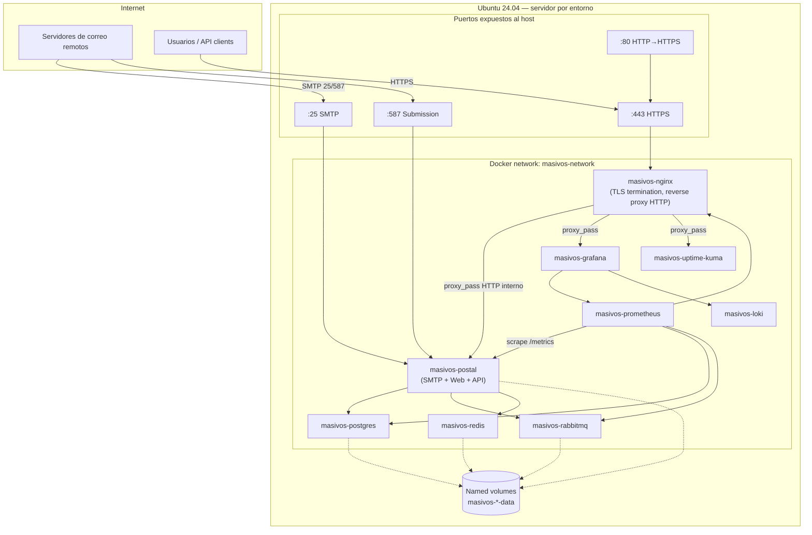

# Arquitectura — masivos-infra

Este documento es la fuente de verdad de las decisiones de arquitectura para la infraestructura de **Masivos.app**. Cualquier cambio estructural (red, puertos, volúmenes, entornos) debe reflejarse aquí antes de implementarse.

## Visión general

`masivos-infra` despliega, desde un Ubuntu 24.04 recién instalado, una plataforma de envío masivo de correo basada en [Postal](https://github.com/postalserver/postal), con observabilidad completa y hardening de seguridad, ejecutando `./bootstrap/install.sh && ./security/hardening.sh && ./scripts/deploy.sh`.

Cada servicio (`services/<nombre>/`) es independiente: tiene su propio `docker-compose.yml`, `.env.example` y documentación. Un compose principal (Sprint 3) orquesta el arranque en el orden correcto de dependencias.

## Diagrama de arquitectura

## Principio de diseño: SMTP nunca pasa por Nginx

Postal necesita hablar SMTP crudo (protocolo L4/L7 no-HTTP) en los puertos 25, 587 y 465. Nginx únicamente termina TLS y enruta las superficies **HTTP** de Postal (panel web, API REST, tracking de aperturas/clicks, webhooks) y de las herramientas de observabilidad expuestas al usuario (Grafana, Uptime Kuma). Nunca se debe intentar proxyar SMTP a través de Nginx `http {}` — requeriría `stream {}` y no aporta ningún beneficio frente a exponer el puerto directamente desde el contenedor de Postal.

## Puertos expuestos en el host

| Puerto | Servicio | Expuesto | Motivo |
|---|---|---|---|
| 22 (o puerto SSH custom) | sshd | Sí | Administración remota — se endurece en Sprint 2 |
| 25 | Postal | Sí | Recepción SMTP entrante |
| 587 | Postal | Sí | Submission (envío autenticado) |
| 465 | Postal | Sí | SMTPS legado, algunos clientes lo requieren |
| 80 | Nginx | Sí | Redirección a HTTPS + validación ACME HTTP-01 de respaldo |
| 443 | Nginx | Sí | Único punto de entrada HTTPS |
| 5432 (Postgres), 5672/15672 (RabbitMQ), 6379 (Redis), 9090 (Prometheus), 3100 (Loki) | — | **No** | Solo accesibles dentro de `masivos-network`; nunca deben publicarse en el host en producción |

## Modelo de entornos

Un **servidor físico/VM por entorno** (`dev`, `test`, `prod`), no un multi-tenant en la misma máquina. El código de `services/*` es idéntico entre entornos; lo único que cambia es `environments/<env>/.env`, que parametriza dominio, IP pública, timezone y credenciales de DNS. Detalle en [`environments/README.md`](../environments/README.md).

Justificación: aislar el blast radius. Un incidente de carga o de seguridad en `dev`/`test` no debe poder afectar el envío de correo de producción ni consumir su reputación de IP.

## Modelo de red Docker

- Red única `masivos-network` (bridge, definida explícitamente con subnet fija — se implementa en `docker/networks.sh`, Sprint 3 — para evitar colisiones con el rango por defecto de Docker).
- Todos los contenedores se resuelven entre sí por nombre (`masivos-postgres`, `masivos-redis`, etc.), sin depender de IPs.
- Ningún servicio de datos (Postgres, RabbitMQ, Redis) publica puertos al host.

## Modelo de volúmenes

Volúmenes Docker nombrados (no bind mounts para datos, salvo configuración):

- `masivos-postgres-data`
- `masivos-rabbitmq-data`
- `masivos-redis-data`
- `masivos-postal-data`
- `masivos-nginx-data`

Se crean de forma idempotente en `docker/volumes.sh` (Sprint 3).

## Convenciones de nombres

| Elemento | Convención | Ejemplo |
|---|---|---|
| Red Docker | `masivos-network` | — |
| Contenedores | `masivos-<servicio>` | `masivos-postal` |
| Volúmenes | `masivos-<servicio>-data` | `masivos-postgres-data` |
| Variables de entorno | `UPPER_SNAKE_CASE` | `POSTGRES_PASSWORD` |
| Scripts | `kebab-case.sh` | `deploy.sh`, `install-docker.sh` |
| Commits | Conventional Commits | `feat(postgres): add backup script` |

## Gestión de secretos

- `.env` real por servicio: generado localmente a partir de `.env.example`, **nunca versionado** (`.gitignore` raíz excluye `*.env` salvo `*.env.example`).
- `environments/<env>/.env`: variables globales del servidor (dominio, IP pública, token de Cloudflare, timezone). Ver [`environments/README.md`](../environments/README.md).
- Ningún script debe loguear valores de variables que contengan `PASSWORD`, `TOKEN`, `SECRET` o `KEY`.

## DNS y TLS

Ver [`docs/dns.md`](dns.md) para el detalle de zona, registros requeridos y automatización de Let's Encrypt vía `certbot-dns-cloudflare` (validación DNS-01, permite wildcard).

## Requisitos mínimos de servidor (por entorno)

| Entorno | vCPU | RAM | Disco | Notas |
|---|---|---|---|---|
| dev | 2 | 4 GB | 40 GB SSD | Sin réplicas, sin backups automatizados obligatorios |
| test | 2 | 4 GB | 40 GB SSD | Espejo funcional de prod a menor escala |
| prod | 4+ | 8 GB+ | 100 GB+ SSD | Escala según volumen de envío; monitorear IOPS de Postgres/RabbitMQ |

## Roadmap de sprints

Ver seguimiento en `CHANGELOG.md`. Orden de implementación:

0. Arquitectura general (este documento)
1. `bootstrap/` — provisión base Ubuntu 24.04
2. `security/` — hardening (SSH, UFW, Fail2Ban, sysctl, logrotate)
3. `docker/` — Docker Engine, red, volúmenes, compose principal
4. `services/postgres/`
5. `services/redis/`
6. `services/rabbitmq/`
7. `services/postal/`
8. `services/nginx/` + Let's Encrypt
9. `services/prometheus/`, `services/grafana/`, `services/loki/`
10. `services/uptime-kuma/`
11. `scripts/` de orquestación (deploy, backup, restore, healthcheck, validate)
12. `.github/workflows/` — CI/CD
