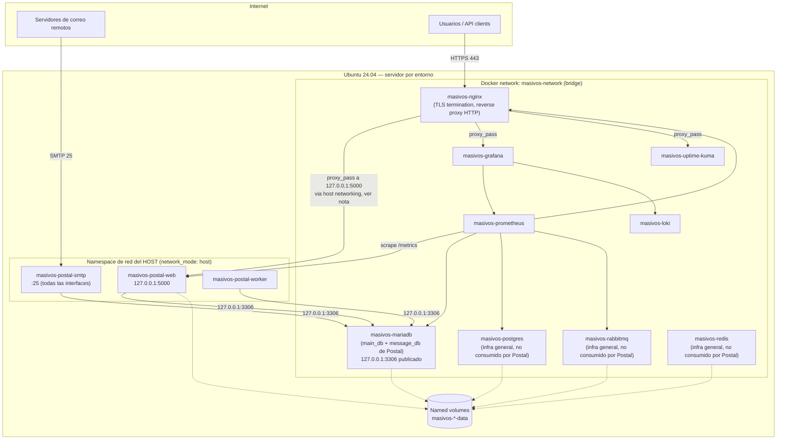

# Arquitectura — masivos-infra

Este documento es la fuente de verdad de las decisiones de arquitectura para la infraestructura de **Masivos.app**. Cualquier cambio estructural (red, puertos, volúmenes, entornos) debe reflejarse aquí antes de implementarse.

## Visión general

`masivos-infra` despliega, desde un Ubuntu 24.04 recién instalado, una plataforma de envío masivo de correo basada en [Postal](https://github.com/postalserver/postal), con observabilidad completa y hardening de seguridad, ejecutando `./bootstrap/install.sh && ./security/hardening.sh && ./scripts/deploy.sh`.

Cada servicio (`services/<nombre>/`) es independiente: tiene su propio `docker-compose.yml`, `.env.example` y documentación. Un compose principal (Sprint 3) orquesta el arranque en el orden correcto de dependencias.

## Diagrama de arquitectura

**Nota (Sprint 7):** verificado contra la documentación oficial de Postal que **Postal v3 requiere MariaDB** (no Postgres) y **no usa RabbitMQ ni Redis** — ver [`services/mariadb/README.md`](../services/mariadb/README.md). Postgres, RabbitMQ y Redis se conservan en el repositorio como infraestructura genérica reutilizable para necesidades futuras.

**Nota (Sprint 8):** verificado contra la plantilla `docker-compose` oficial de Postal que sus contenedores (`web`, `smtp`, `worker`) usan **`network_mode: host`**, no `masivos-network` — es el patrón soportado por el propio proyecto (permite que el contenedor SMTP bindee el puerto 25 vía `cap_add: NET_BIND_SERVICE` y que los tres procesos compartan namespace de red sin publicarse puertos entre sí). Esto tiene dos consecuencias que rompen con el patrón del resto del stack:

1. **MariaDB publica `3306` en `127.0.0.1`** (además de seguir en `masivos-network`) para que Postal, en el namespace de red del host, pueda alcanzarlo — mismo patrón de bind a loopback que RabbitMQ (ver más abajo), aplicado aquí por necesidad técnica de conectividad, no solo para un panel de administración.
2. **Nginx (Sprint 9) necesita una vía especial para alcanzar `127.0.0.1:5000`** (el panel web de Postal, que bindea loopback por defecto): o bien Nginx también corre en `network_mode: host`, o usa `extra_hosts: host-gateway` para resolver la IP del host desde `masivos-network`. Se decide en el Sprint 9, no aquí.

## Principio de diseño: SMTP nunca pasa por Nginx

Postal necesita hablar SMTP crudo (protocolo L4/L7 no-HTTP) en el puerto 25 — el único puerto SMTP que Postal v3 expone (verificado contra su configuración de referencia; no existen listeners separados de submission/SMTPS en 587/465, a diferencia de lo que se asumió en el diseño original de este documento). Nginx únicamente termina TLS y enruta la superficie **HTTP** de Postal (panel web en `127.0.0.1:5000`) y de las herramientas de observabilidad expuestas al usuario (Grafana, Uptime Kuma). Nunca se debe intentar proxyar SMTP a través de Nginx `http {}` — requeriría `stream {}` y no aporta ningún beneficio frente a exponer el puerto directamente.

## Puertos expuestos en el host

| Puerto | Servicio | Expuesto | Motivo |
|---|---|---|---|
| 22 (o puerto SSH custom) | sshd | Sí | Administración remota — se endurece en Sprint 2 |
| 25 | Postal (`network_mode: host`) | Sí | Único puerto SMTP de Postal v3 (recepción y envío autenticado) — verificado en el Sprint 8; no existen 587/465 en Postal |
| 80 | Nginx | Sí | Redirección a HTTPS + validación ACME HTTP-01 de respaldo |
| 443 | Nginx | Sí | Único punto de entrada HTTPS |
| 15672 (RabbitMQ management) | RabbitMQ | Solo `127.0.0.1` | Panel de administración, accesible únicamente vía túnel SSH (`ssh -L`) — ver [`services/rabbitmq/README.md`](../services/rabbitmq/README.md) |
| 3306 (MariaDB) | MariaDB | Solo `127.0.0.1` | Postal (`network_mode: host`, Sprint 8) lo alcanza vía loopback — no es un panel de administración, es conectividad real necesaria |
| 5000 (Postal web) | Postal (`network_mode: host`) | Solo `127.0.0.1` | Panel web/API de Postal; público solo a través del proxy de Nginx (Sprint 9) |
| 5432 (Postgres), 5672 (RabbitMQ AMQP), 6379 (Redis), 9090 (Prometheus), 3100 (Loki) | — | **No** | Solo accesibles dentro de `masivos-network`; nunca deben publicarse en el host en producción |

### Bind a `127.0.0.1` para paneles de administración

Algunos servicios internos (RabbitMQ, y potencialmente otros en el futuro) exponen un panel web de administración que un operador humano necesita ver, pero que no debe ser alcanzable desde Internet. El patrón es: publicar ese puerto **únicamente en `127.0.0.1`** (`127.0.0.1:<puerto>:<puerto>` en el `docker-compose.yml` del servicio), nunca en `0.0.0.0` ni sin especificar IP (que Docker interpreta como `0.0.0.0`). UFW nunca abre estos puertos — son inalcanzables desde fuera del propio host por definición del bind. El acceso operativo es vía `ssh -L <puerto>:127.0.0.1:<puerto>` (por eso `security/ssh/` mantiene `AllowTcpForwarding yes`, ver [`docs/security.md`](security.md)). Esto es distinto de "expuesto al host" en el sentido de la tabla anterior — ahí "Sí" significa alcanzable desde Internet a través de UFW; el bind a loopback nunca lo es.

## Modelo de entornos

Un **servidor físico/VM por entorno** (`dev`, `test`, `prod`), no un multi-tenant en la misma máquina. El código de `services/*` es idéntico entre entornos; lo único que cambia es `environments/<env>/.env`, que parametriza dominio, IP pública, timezone y credenciales de DNS. Detalle en [`environments/README.md`](../environments/README.md).

Justificación: aislar el blast radius. Un incidente de carga o de seguridad en `dev`/`test` no debe poder afectar el envío de correo de producción ni consumir su reputación de IP.

## Modelo de red Docker

- Red única `masivos-network` (bridge, definida explícitamente con subnet fija — se implementa en `docker/networks.sh`, Sprint 3 — para evitar colisiones con el rango por defecto de Docker).
- Todos los contenedores se resuelven entre sí por nombre (`masivos-postgres`, `masivos-redis`, etc.), sin depender de IPs.
- Ningún servicio de datos (Postgres, RabbitMQ, Redis) publica puertos al host.
- **Excepción: Postal (Sprint 8) no está en `masivos-network`.** Sus contenedores usan `network_mode: host`, siguiendo la plantilla oficial del proyecto — ver la nota completa en el diagrama de arquitectura, arriba.

## Modelo de volúmenes

Volúmenes Docker nombrados (no bind mounts para datos, salvo configuración):

- `masivos-mariadb-data` — base de datos real de Postal (`main_db` + `message_db`), añadido en el Sprint 7
- `masivos-postgres-data`
- `masivos-rabbitmq-data`
- `masivos-redis-data`
- `masivos-postal-data`
- `masivos-nginx-data`

Se crean de forma idempotente en `docker/volumes.sh` (Sprint 3; `masivos-mariadb-data` añadido en el Sprint 7).

**Por qué Postgres/Redis/RabbitMQ siguen aquí si Postal no los usa:** se construyeron (Sprints 4-6) siguiendo el stack originalmente solicitado, antes de verificar contra la documentación oficial de Postal que v3 no los requiere (solo MariaDB — ver [`services/mariadb/README.md`](../services/mariadb/README.md)). Se conservan como infraestructura genérica de la plataforma, disponible para necesidades futuras que no sean Postal (caché de aplicación, colas de trabajos propios, analítica), no como componentes huérfanos.

## Convenciones de nombres

| Elemento | Convención | Ejemplo |
|---|---|---|
| Red Docker | `masivos-network` | — |
| Contenedores | `masivos-<servicio>` | `masivos-postal` |
| Volúmenes | `masivos-<servicio>-data` | `masivos-postgres-data` |
| Variables de entorno | `UPPER_SNAKE_CASE` | `POSTGRES_PASSWORD` |
| Scripts | `kebab-case.sh` | `deploy.sh`, `install-docker.sh` |
| Commits | Conventional Commits | `feat(postgres): add backup script` |

## Gestión de secretos

- `.env` real por servicio: generado localmente a partir de `.env.example`, **nunca versionado** (`.gitignore` raíz excluye `*.env` salvo `*.env.example`).
- `environments/<env>/.env`: variables globales del servidor (dominio, IP pública, token de Cloudflare, timezone). Ver [`environments/README.md`](../environments/README.md).
- Ningún script debe loguear valores de variables que contengan `PASSWORD`, `TOKEN`, `SECRET` o `KEY`.

## DNS y TLS

Ver [`docs/dns.md`](dns.md) para el detalle de zona, registros requeridos y automatización de Let's Encrypt vía `certbot-dns-cloudflare` (validación DNS-01, permite wildcard).

## Requisitos mínimos de servidor (por entorno)

| Entorno | vCPU | RAM | Disco | Notas |
|---|---|---|---|---|
| dev | 2 | 4 GB | 40 GB SSD | Sin réplicas, sin backups automatizados obligatorios |
| test | 2 | 4 GB | 40 GB SSD | Espejo funcional de prod a menor escala |
| prod | 4+ | 8 GB+ | 100 GB+ SSD | Escala según volumen de envío; monitorear IOPS de Postgres/RabbitMQ |

## Roadmap de sprints

Ver seguimiento en `CHANGELOG.md`. Orden de implementación:

0. Arquitectura general (este documento)
1. `bootstrap/` — provisión base Ubuntu 24.04
2. `security/` — hardening (SSH, UFW, Fail2Ban, sysctl, logrotate)
3. `docker/` — Docker Engine, red, volúmenes, compose principal
4. `services/postgres/` — infra general (Postal no lo usa, ver Sprint 7)
5. `services/redis/` — infra general (Postal no lo usa, ver Sprint 7)
6. `services/rabbitmq/` — infra general (Postal no lo usa, ver Sprint 7)
7. `services/mariadb/` — base de datos real de Postal (verificado contra la documentación oficial)
8. `services/postal/`
9. `services/nginx/` + Let's Encrypt
10. `services/prometheus/`, `services/grafana/`, `services/loki/`
11. `services/uptime-kuma/`
12. `scripts/` de orquestación (deploy, backup, restore, healthcheck, validate)
13. `.github/workflows/` — CI/CD
